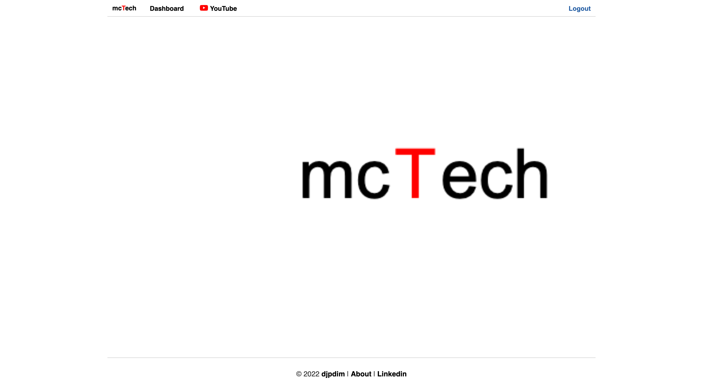
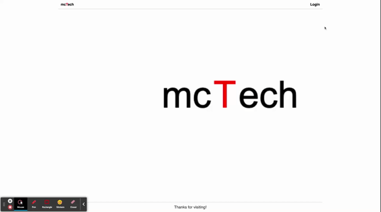

# mcTech-Tech-Blog

## Description

-   This project is a CMS-style blog where developers can publish their blog posts and comment on other developers post. This application follows the MVC paradigm in it's structure and uses Handlebars.js as the templating language, Sequelize as the ORM, and the express-session npm package for authentication.

## Link to the app

Link to the deployed page at Heroku: [mcTech-Tech-Blog](https://mctech-tech-blog.herokuapp.com/)

Link to the github app: [mcTech-Tech-Blog](https://github.com/djpdim/mctech-tech-blog)

Link to the github page: [mcTech-Tech-Blog](https://djpdim.github.io/mctech-tech-blog/)

Demo: [mcTech-Tech-Blog](https://drive.google.com/file/d/1tx24AZ8WGZhDRvfPEpqLJuHXLgaRwdDR/view)

## Tample of Content

-   [Installation](#installation)
-   [Usage](#usage)
-   [Credits](#credits)
-   [License](#license)
-   [Features](#features)
-   [Questions](#questions)

## Installation

-   The user should clone the repository from GitHub, it requires Node.js, Express.js, Sequelize, mysql2, connection-session/express-session, and Jest.

    -   If cloning the repo, run npm i to run all modules.
    -   To connect to the database run mysql -u root -p and enter password, then source the schema.sql.
    -   To connect to the server run npm start.

## Usage

This application will allow users to sign up if they are not a member, then once they are logged in they are able to view their dashboard of posts to view, add, edit, and delete blog posts and comment on other developers post.

## Credits

-   Tutors and TA's

## License

-   MIT

## Badges

Check out the badges hosted by [shields.io](https://shields.io/).

## Features

## Questions

For any questions, please contact me to the informations below:

-   GitHub: [djpdim](https://github.com/djpdim)
-   Email: [dimospagkas@yahoo.gr](mailto:dimospagkas@yahoo.gr)

[Top](#description)
